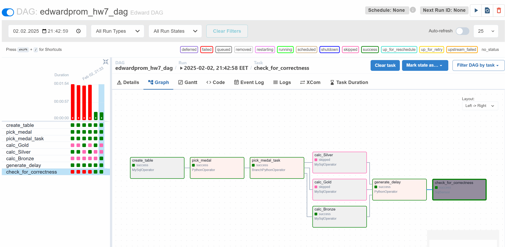
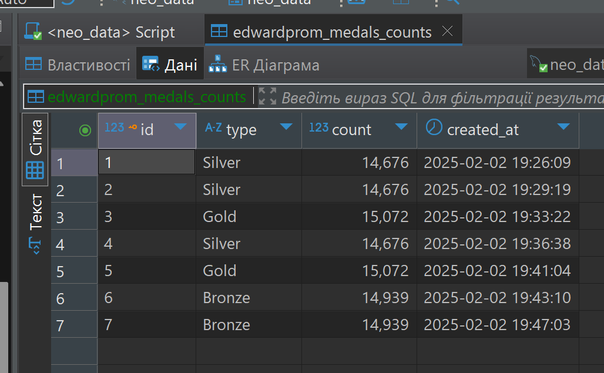
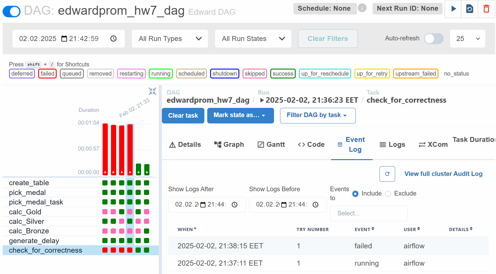

<!-- mkdir -p ./dags ./logs ./plugins ./config
echo -e "AIRFLOW_UID=$(id -u)" > .env

docker compose up airflow-init

docker compose up -->

## Опис завдання
Це домашнє завдання включає реалізацію DAG у Apache Airflow для роботи з MySQL, логіку розгалуження, затримки виконання та використання сенсора. 

## Використання Docker
Для запуску середовища Apache Airflow використовувався `docker-compose.yaml`. 

## Скриншоти
### Виконання DAG

### База даних з підрахунками медалей

### Логи сенсора перевірки

## Висновок
DAG успішно реалізує всі вимоги:

✅ Створює таблицю.  
✅ Обирає випадкове значення.  
✅ Запускає відповідне завдання.  
✅ Виконує підрахунок медалей.  
✅ Використовує затримку перед перевіркою.  
✅ Сенсор перевіряє актуальність даних.  
